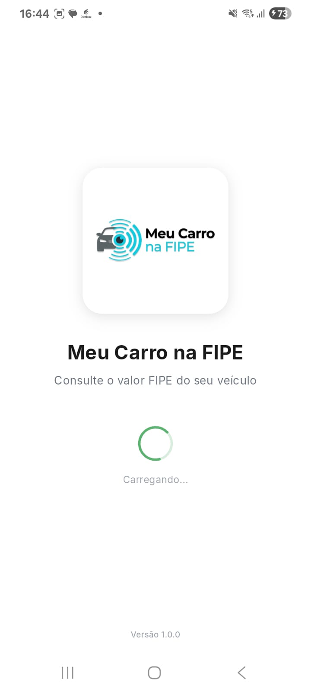
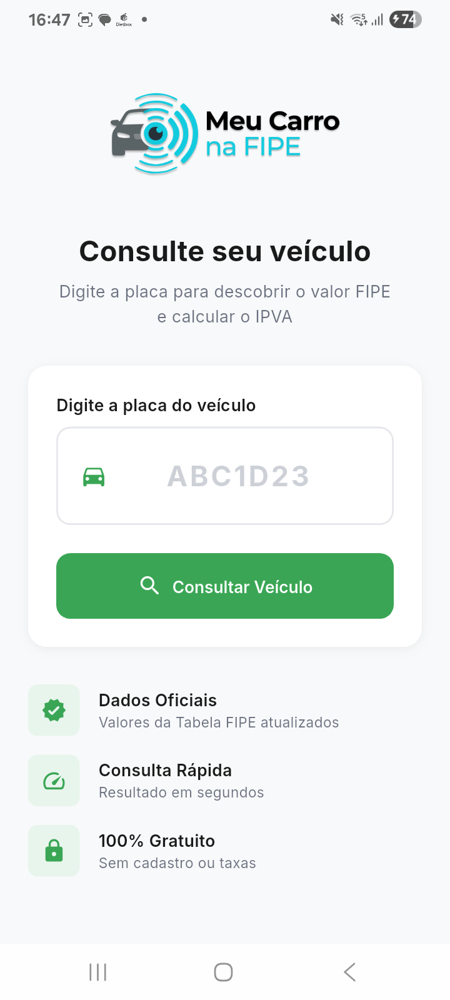
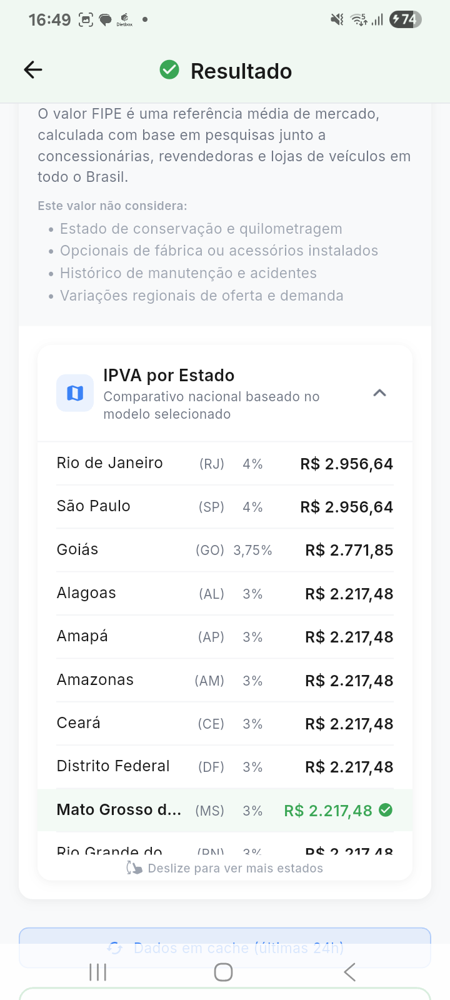

<p align="center">
  
</p>

<h1 align="center">Meu Carro na FIPE</h1>

<p align="center">
  <strong>Consulte o valor FIPE do seu veículo pela placa</strong>
</p>

<p align="center">
  
  
  
  
</p>

---

## Sobre o Aplicativo

O **Meu Carro na FIPE** é um aplicativo mobile que permite consultar de forma rápida e gratuita o valor de mercado de veículos através da Tabela FIPE (Fundação Instituto de Pesquisas Econômicas).

Basta informar a placa do veículo para obter instantaneamente:
- Dados completos do veículo
- Valor FIPE atualizado
- Cálculo do IPVA para todos os estados

---

## Funcionalidades

### Consulta por Placa
- Suporte a placas no formato antigo (ABC-1234) e Mercosul (ABC1D23)
- Validação automática do formato da placa
- Consulta rápida com retorno em segundos

### Dados do Veículo
- **Identificação**: Placa, marca, modelo e versão
- **Características**: Ano/modelo, cor, combustível
- **Localização**: UF e município de registro
- **Segurança**: Chassi parcialmente oculto

### Valor FIPE
- Valor de mercado atualizado mensalmente
- Código FIPE oficial do modelo
- Mês de referência da cotação
- Múltiplos modelos quando disponíveis (permite seleção)

### Cálculo de IPVA
- IPVA calculado automaticamente para o estado do veículo
- **Comparativo nacional**: Valores de IPVA para todos os 27 estados
- Alíquotas atualizadas por estado
- Ordenação do maior para o menor valor

### Performance
- Cache inteligente de 24 horas
- Indicador visual quando dados são do cache
- Loading states e feedback visual
- Tratamento de erros amigável

---

## Screenshots

<p align="center">
  
  
  
  
</p>

---

## Tecnologias Utilizadas

| Tecnologia | Descrição |
|------------|-----------|
| **Flutter** | Framework de desenvolvimento multiplataforma |
| **Dart** | Linguagem de programação |
| **Provider** | Gerenciamento de estado |
| **HTTP** | Requisições para API |
| **Supabase Edge Functions** | Backend serverless |
| **API FIPE** | Dados oficiais da Tabela FIPE |

### Dependências Principais

```yaml
dependencies:
  flutter: sdk
  provider: ^6.1.1        # Gerenciamento de estado
  http: ^1.1.0            # Requisições HTTP
  google_fonts: ^6.1.0    # Fontes personalizadas
  intl: ^0.18.1           # Formatação de valores
  shimmer: ^3.0.0         # Efeitos de loading
  fl_chart: ^0.65.0       # Gráficos (histórico)
```

---

## Estrutura do Projeto

```
lib/
├── main.dart                 # Entry point
├── app.dart                  # Configuração do MaterialApp
│
├── core/                     # Núcleo da aplicação
│   ├── theme/
│   │   └── app_theme.dart    # Design system (cores, fontes, espaçamentos)
│   ├── constants/
│   │   └── app_constants.dart # Constantes e configurações
│   └── utils/
│       └── formatters.dart   # Funções de formatação
│
├── data/                     # Camada de dados
│   ├── models/
│   │   ├── vehicle_model.dart    # Modelo do veículo
│   │   └── fipe_model.dart       # Modelos FIPE e resposta da API
│   └── services/
│       └── api_service.dart      # Serviço de comunicação com API
│
└── presentation/             # Camada de apresentação
    ├── providers/
    │   └── consulta_provider.dart  # Estado da consulta
    ├── screens/
    │   ├── splash_screen.dart      # Tela de splash
    │   ├── home_screen.dart        # Tela inicial (consulta)
    │   └── result_screen.dart      # Tela de resultados
    └── widgets/
        ├── plate_input.dart        # Campo de entrada da placa
        ├── vehicle_card.dart       # Card com dados do veículo
        ├── ipva_card.dart          # Card de IPVA
        ├── fipe_models_list.dart   # Lista de modelos FIPE
        └── fipe_value_card.dart    # Card com valor FIPE detalhado
```

---

## Design System

### Cores

| Nome | Hex | Uso |
|------|-----|-----|
| Primary | `#3AA655` | Ações principais, destaques |
| Primary Light | `#E8F5EC` | Backgrounds suaves |
| Background | `#F8F9FA` | Fundo das telas |
| Surface | `#FFFFFF` | Cards e superfícies |
| Text Primary | `#1A1A1A` | Textos principais |
| Text Secondary | `#6B7280` | Textos secundários |
| Success | `#10B981` | Feedback positivo |
| Warning | `#F59E0B` | Alertas |
| Error | `#EF4444` | Erros |

### Tipografia

- **Fonte**: Inter (Google Fonts)
- **Pesos**: Regular (400), Medium (500), SemiBold (600), Bold (700)

### Espaçamentos

| Token | Valor |
|-------|-------|
| xs | 4px |
| sm | 8px |
| md | 16px |
| lg | 24px |
| xl | 32px |

---

## Como Executar

### Pré-requisitos

- Flutter SDK 3.0+
- Dart SDK 3.0+
- Android Studio / Xcode (para emuladores)

### Instalação

```bash
# Clone o repositório
git clone https://github.com/seu-usuario/meucarronafipe.git

# Entre na pasta do projeto
cd meucarronafipe

# Instale as dependências
flutter pub get

# Execute o app
flutter run
```

### Build para Produção

```bash
# Android (APK)
flutter build apk --release

# Android (App Bundle)
flutter build appbundle --release

# iOS
flutter build ios --release
```

---

## API

O aplicativo consome uma Edge Function hospedada no Supabase que:

1. **Decodifica a placa** usando serviço de consulta veicular
2. **Busca na FIPE** os modelos correspondentes à marca/modelo
3. **Calcula o IPVA** baseado no valor FIPE e estado do veículo
4. **Cacheia resultados** por 24 horas para otimização

### Endpoint

```
POST https://[supabase-url]/functions/v1/consulta-placa
Content-Type: application/json

{
  "plate": "ABC1D23"
}
```

### Resposta

```json
{
  "vehicle": {
    "placa": "ABC1D23",
    "marca": "HONDA",
    "modelo": "CG 160 FAN",
    "anoModelo": 2018,
    "ano": 2017,
    "uf": "MS",
    "municipio": "Campo Grande",
    "cor": "Preta",
    "combustivel": "GASOLINA/ALCOOL"
  },
  "fipeModels": [
    {
      "codigo": "811147-2",
      "nome": "CG 160 FAN Flex",
      "valor": 12992.00,
      "mesReferencia": "dezembro de 2025",
      "combustivel": "Flex"
    }
  ],
  "ipvaPrincipal": {
    "estado": "MS",
    "valor": 389.76,
    "aliquota": 3.0
  }
}
```

---

## Tabela de Alíquotas IPVA

| Estado | Alíquota |
|--------|----------|
| MG, RJ, SP | 4% |
| GO | 3,75% |
| AL, AM, AP, CE, DF, MS, RN, RO, RR, RS | 3% |
| BA, MA, PA, PB, PI, SE | 2,5% |
| AC, ES, MT, SC, TO | 2% |
| PR | 1,9% |
| PE | 1,5% |

---

## Contribuindo

Contribuições são bem-vindas! Sinta-se à vontade para:

1. Fazer um Fork do projeto
2. Criar uma branch para sua feature (`git checkout -b feature/NovaFeature`)
3. Commit suas mudanças (`git commit -m 'Adiciona nova feature'`)
4. Push para a branch (`git push origin feature/NovaFeature`)
5. Abrir um Pull Request

---

## Licença

Este projeto está sob a licença MIT. Veja o arquivo [LICENSE](LICENSE) para mais detalhes.

---

## Autor

Desenvolvido por **Cesar Bassani**

---

## 📞 Suporte

- Website: [meucarronafipe.com.br](https://meucarronafipe.com.br)
- Email: contato@meucarronafipe.com.br
- Linkedin: https://www.linkedin.com/in/cesarbassani

---

<p align="center">
  <strong>⭐ Se este projeto te ajudou, deixe uma estrela!</strong>
</p>